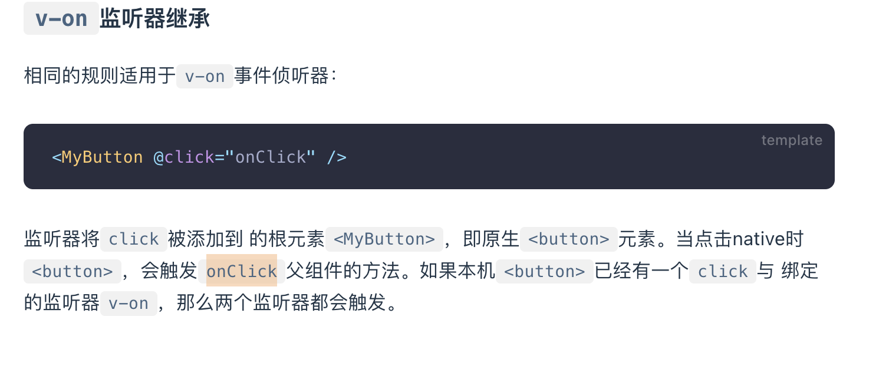
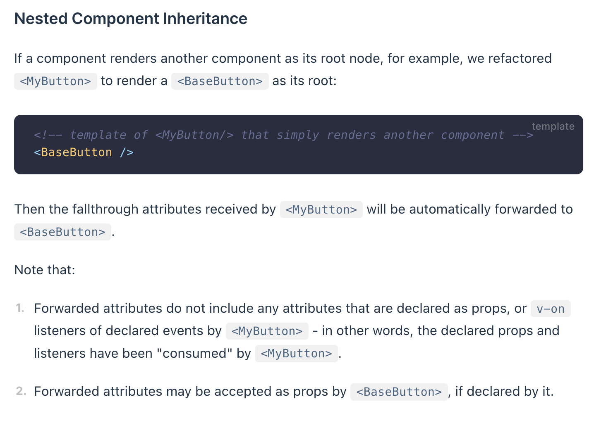
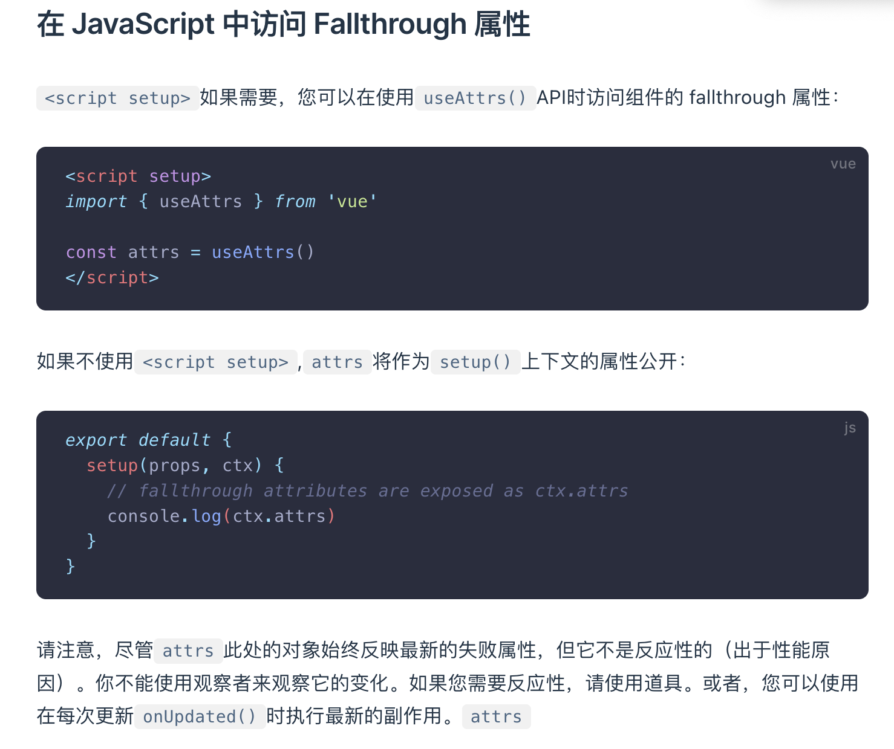

<!-- ##### 单页应用程序的优势(相较于多页面程序) 或许并没有优势或则说是更合适的，减少对与服务器的请求了，通过vue-router等路由插件来模拟页面的跳转 -->
#### vue3数据更新了之后Dom并不是立即更新而是等到下一个nextTick周期的时候才会进行统一的DOM更新，但是这个nextTick是什么时候进行更新我并不是十分清楚,应该是页面重新说刷新的时候才进行更新，但是这就需要知道那个可以知道啥时候进行更新的接口
<!-- #### reactive响应式测试
 就是监听引用对象的属性 但是当引用对象切换了之后是无法监听到之前对象的变换的-->
<!-- **最主要的是想知道reactive和ref之前的区别**
ref本质上还是reactive 但是由于reactive无法对基本进行就响应式（let obj = reactive({obj:1}); obj =  [2,323]这样直接变换引用的时候是无法监听到obj变换的，这里就需要使用ref来进行监听，obj其实就变换成了{value:obj}这样来就可以监听到obj的变换）
#### reactive的限制中 reactiv根本上没法监听基础类型的原因究竟是什么呢？ 这个根本原因应该是proxy的原因
 -->
<!-- 
#### reactive和ref的根本上的区别和原理是什么了？为啥ref就可以直接将基础元素实现响应式嗯？但是为啥要在元素中添加个value，还是说本质上其实是一样的呢？ -->

<!-- #### what's happend when nactive element binding click event?

> the child component will be binding native event and self event (this sort is slef to native) -->

<!-- ### how to through attrs on nested component?

>确实是会传递给孙子组件 -->

<!-- #### hot to make attrs reactive? 父组件中的reactive对象中的数据如何在子组件中修改了？

> 在子组件中可以直接使用父组件传来的reactive数据 并且在父组件中也是可以实现响应式的 。 -->

<!-- 
意识是多选只有没有被选择的时候可以使用false-value来设置，没有选的时候也是有值的  正确的意识是只有这个checkbox作为单选的时候，只有一个的才会实现yes no的切换，v-model中绑定的数据是个普通数据不是数组的时候-->

<!--  这的意识是失去光标或者enter之后才会执行change数据，才会重新同步数据，并不是实时更新而是失去光标之后才更新 -->
<!-- model还是使用emit来做u哦 和普通的没啥差别 -->
<!-- 
watch只能监听到响应式数据的变换 但是可以监听到普通对象用getter返回的情况 -->
<!--  -->
<!--  -->
<!--  -->
<!--  -->
<!-- 
 -->

<!-- 
不是太理解 为什么webpack5中要assert/resource 要加强资源的耦合了现在 之前不是要求分开的。这个加强资源的耦合应该是主要是放在了作为第三方资源或则是组件的时候 可以直接对整个模块进行导入不比需要在外部进行资源的导入。对于自己的项目来说资源最好是整合到一起比较好看点 -->
<!--  这个预加载是当前页面素材加载的时候同步加载的，但是也可以异步来对数据进行加载，自己来控制加载，可以用import来异步加载，也可以用script来加载，但是script加载出错的时候不会抛出任何错误，webpack自动移除该错误-->

<!-- 应该是名称创建规则有啥哇？但看文档的解释是运行的时候入口文件中包含了一些样板文件或则是模板哇，应该是这样的，应该是运行时候的一些模板变换了引起了名称的变换 -->

<!-- 不太理解这个运行时的文件到底是包含了些啥内容 是编译之后的所有文件的内容吗？还是什么呢？应该是运行时需要的一些程序文件哇 -->

<!--  -->

<!--  -->
<!-- 
 整个部分都不太明白 这个部分是另一个内容的执行过程哇 -->

【THREE】绘制一个以线条为例子的3d世界
【THREE】理论知识和基础知识需要先看下 
【THREE】基础的知识部分需要运行一遍
【THREE】网站完成了一个大致的浏览，明确了每个地方都是展示啥的
【THREE】const camera = new THREE.PerspectiveCamera(75,window.innerWidth / window.innerHeight, 0.1,1000)方法中的每个参数分别代表着什么了？会对图像有啥影响吗？（需要查看下 宽高比会影响到mesh的大小和形状啊咋）
【THREE】响应式变换有点问题 (renderer.setSize(canvas.clientWidth, canvas.clientHeight)  //边缘块状化) 这个宽度是手动的宽度变化是什么意识了？ 为啥canvsa.clientWidth 可以 window.innerHeight也可以了 不是十分理解这种情况 需要重新明白这些问题 本周五需要完成
<!-- 【THREE】mesh.rotation mesh元素的旋转角度是如何设置了？ 绕着某个元素进行旋转的情况 position位置的设置为什么会旋转了 设置了x 和 y 的变换 坐标是相对于mesh原生的坐标还是相对于canvas坐标系的坐标了 rotation.x-->
<!-- 【THREE】 geometry元素的颜色有问题 为什么都不是对应的数据呢 ? 颜色的问题应该是光的问题导致的 -->

<!-- 【THREE】ConeGeometry 圆锥的底边 即使设置的值非常大了还是不是很光滑 -->
【THREE】鼠标事件来移动位置和元素，主要是对控制器的使用
<!-- 【THREE】需要将多余相同的元素进行抽离和封装然后方便元素的使用 -->
【THREE】LatheGeometry元素内部为什么是黑色的呢 Vector1 2 3 这个向量方法是有什么不同吗？
<!-- 【THREE】修改场景的背景颜色 -->
【THREE】场景中放置一个立体的文本，这个部分可以直接获取到
<!-- 【THREE】使用骨架之后为什么已经去掉了灯光了 还有黑色在旋转啊 -->
【THREE】接着查看图元部分，将剩余的基础的一些元素也都看完 还有就是文字的那个尤其是
【THREE】controls.update()  控制器-autoRotate没有任何效果啊
【THREE】控制器的属性为什么改变了之后没有任何变动呢
<!-- 【THREE】这个线框是如何完成的了以及这个黑色的内容是什么了 线条的素材要用LineBasicMaterial-->